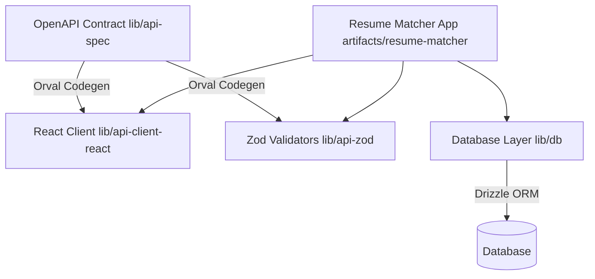

# Resume Verifier — Full-Stack Resume Matching & Evaluation Engine

[](https://pnpm.io/)
[](https://www.typescriptlang.org/)
[](https://openapis.org)
[](https://orm.drizzle.team/)
[](LICENSE)

**Resume Verifier** is an enterprise resume-to-job matching, candidate ranking, and evaluation engine. Structured as a `pnpm` monorepo workspace, it features OpenAPI-driven code generation, runtime Zod type validation, candidate penalty breakdowns, domain alignment scoring, and stability testing.

---

## Key Features

- **pnpm Monorepo Workspace**: Modular separation of API specification (`lib/api-spec`), React client (`lib/api-client-react`), Zod validators (`lib/api-zod`), database layer (`lib/db`), and frontend artifacts (`artifacts/resume-matcher`).
- **OpenAPI Schema Contract**: Single-source-of-truth API specification using OpenAPI 3.0 and Orval codegen.
- **Deterministic Penalty & Alignment Engines**: Evaluates candidate experience gaps, missing skills, cost models, and domain alignment distributions.
- **Reliability & Stability Testing**: Pairwise comparisons and ranking stability evaluations across candidate pools.
- **Drizzle ORM Database Persistence**: Type-safe relational database schemas and migrations.

---

## Monorepo Architecture



---

## Workspace Directory Structure

```
resume-verifier/
├── datasets/                 # Evaluation cases, failure cases, resume/job benchmarks
├── lib/
│   ├── api-spec/             # OpenAPI 3.0 definition & Orval config
│   ├── api-client-react/     # Generated React fetch hooks
│   ├── api-zod/              # Generated runtime Zod validation schemas
│   └── db/                   # Drizzle ORM schema definitions & migrations
├── scripts/                  # Workspace management scripts
├── pnpm-workspace.yaml       # Monorepo package workspace configuration
├── LICENSE                   # MIT License
└── .github/workflows/ci.yml # Monorepo CI verification workflow
```

---

## Quick Start

### 1. Prerequisites & Setup

```bash
npm install -g pnpm
git clone https://github.com/dathasaiswaroopgudimella-png/resume-verifier.git
cd resume-verifier
pnpm install
```

### 2. Type Check Workspace

```bash
pnpm --recursive run check-types
```

---

## License

This project is licensed under the [MIT License](LICENSE).
